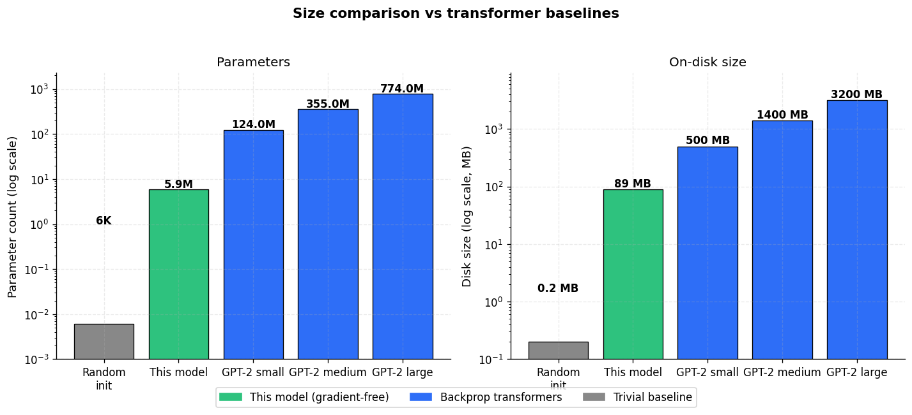
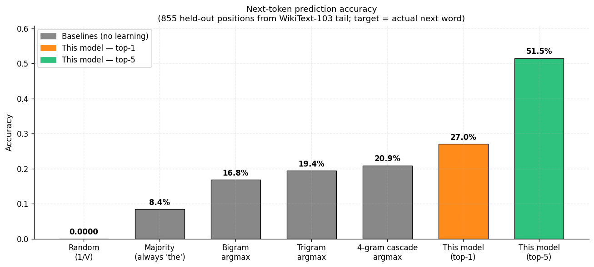
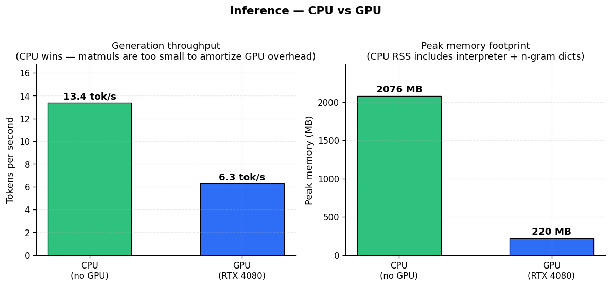
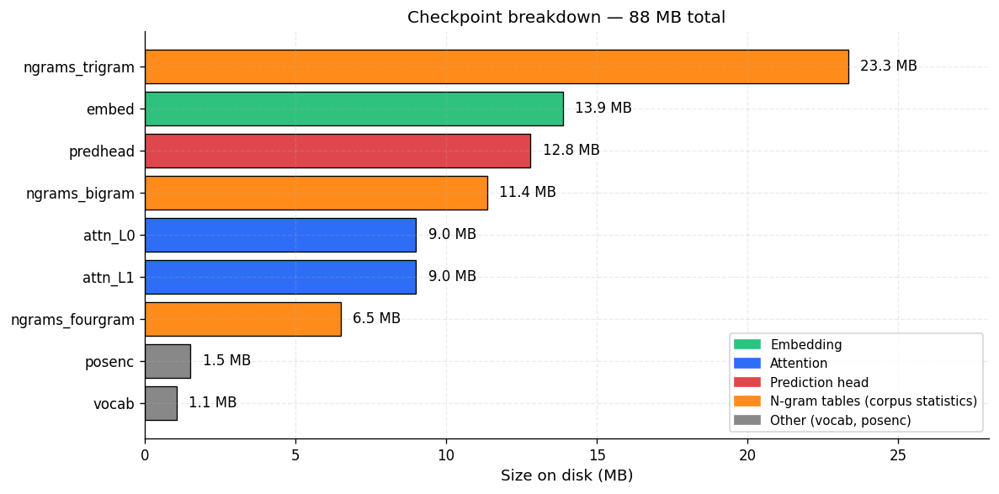

# GENREG LM

A compact language model whose parameters were produced **without
gradient descent and without backpropagation**. This repository ships
the frozen checkpoints and the scripts needed to run inference and
benchmark the model. It does not include training code.

Expect **short, English-like fragments** from WikiText-style prompts.
The model is not competitive with transformer LMs trained on GPUs.
It exists to demonstrate that a functioning LM pipeline can be built
end-to-end from gradient-free components.

## Size comparison



~5.9 M evolvable parameters across all components, ~89 MB on disk.
For reference, GPT-2 small has 124 M parameters and ~500 MB on disk.

## What this is

A small LM stack that takes a text prompt and autoregressively samples
a continuation:

```
tokens
  -> Embedding             (51,641 x 768)
  -> Positional Encoding   (512 positions x 768)
  -> 2-layer Causal Attention (6 heads x 128 dim)
  -> Prediction Head       (SVD-compressed ridge, D=768 -> V=51,641)
  -> n-gram blend          (2/3/4-gram cascade)
  -> sample
```

Every learned weight was discovered by population-based search over a
fitness landscape. No weight was updated via a loss gradient. The n-gram
tables are pre-computed corpus statistics.

## Install

```bash
pip install -r requirements.txt
```

Requires PyTorch and NumPy. Python 3.8+. **GPU is NOT required** —
the model is too small for GPU parallelism to help; CPU is faster.

## Quick start

### Interactive mode

```bash
python inference.py
```

Drop into a REPL. Type a prompt, the model continues it. Commands:

| command | effect |
|---|---|
| `/temp 0.4`  | sampling temperature |
| `/topk 20`   | top-k candidates to sample from |
| `/len 30`    | max tokens to generate |
| `/ngram 1.0` | 0 = pure attention head, 1 = pure n-gram (best) |
| `/rep 1.2`   | repetition penalty |
| `/quit`      | exit |

### One-shot

```bash
python inference.py --prompt "the battle of waterloo was" --max-tokens 30
```

### Benchmark

```bash
python benchmark.py               # CPU by default
python benchmark.py --both        # CPU + GPU side-by-side
python benchmark.py --quick
```

Measures load time, throughput (tokens/sec), next-token accuracy vs a
trigram oracle, memory footprint, and prints sample generations.

## Performance

### Next-token accuracy



Evaluated on 855 held-out positions from the WikiText-103 corpus tail.
Each baseline is scored with its argmax prediction against the true
next token (char tokens excluded). "This model" is the full attention
+ n-gram cascade pipeline with char-ban.

| method | top-1 |
|---|---|
| Random (1/V) | 0.002% |
| Majority class (always "the") | 8.4% |
| Bigram argmax | 16.8% |
| Trigram argmax | 19.4% |
| 4-gram cascade argmax | 20.9% |
| **This model top-1** | **27.0%** |
| **This model top-5** | **51.5%** |

### CPU vs GPU



CPU is ~2× faster than a RTX 4080 for this workload. The evolved
components are small matmuls (512×768 at most), and the n-gram cascade
is pure Python dict lookups that don't see a GPU at all. GPU overhead
(kernel launches, host↔device transfers) dominates when the compute
is this small.

Run `python benchmark.py --both` to reproduce on your machine.

### Checkpoint breakdown



No individual file exceeds 25 MB, so the repository ships cleanly
without Git LFS. N-gram tables are split by order (bigram, trigram,
4-gram) to stay under the limit; the embedding's PPMI-SVD hash is
stored at float16 precision and upcast at load time.

## Output samples

Best mode (pure n-gram + char-ban, `/ngram 1.0`, temp 0.4):

```
> the battle of waterloo was
< less important agent for an agent the game the lowest level the
  aircraft is in lowest walks allowed at intervals over for military
  band over the game

> the film was directed by
< anthony freud aa mounts these events were incorporated elements
  incorporated his wife anne hathaway who later recalled the words
  is short the user and takes its title one review

> she was born in
< on an american on to lose interest is often confused the number
  and severity it often is for and won six world in and his complaint
  from number eight being
```

- Grammatical fragments work
- Proper names pop up occasionally ("anne hathaway", "waterloo")
- Multi-sentence coherence does not exist
- Topics drift every 10–20 tokens
- Output can include real facts that happen to appear in the training
  corpus — the model memorizes local n-gram patterns

The sampling blends the attention+ridge head with the n-gram cascade.
Empirically the attention pathway degrades generation at nonzero
mixing weights; pure n-gram (`ngram_weight=1.0`) gives the best
output. Try `/ngram 0` to see the attention-only output as a contrast.

## Repository layout

```
github_repo/
├── README.md
├── requirements.txt
├── inference.py           REPL + one-shot prompt
├── benchmark.py           load / throughput / accuracy / samples / --both
├── assets/                comparison charts
├── lib/
│   ├── encoder.py         activation catalog
│   └── model.py           frozen components + GenregLM wrapper
└── checkpoints/
    ├── vocab.pkl             token <-> id (V = 51,641)
    ├── embed.pkl             token embedding
    ├── posenc.pkl            positional encoding
    ├── attn_L0.pkl           causal attention layer 0
    ├── attn_L1.pkl           causal attention layer 1
    ├── predhead.pkl          prediction head (SVD-compressed)
    ├── ngrams_bigram.pkl     2-gram table
    ├── ngrams_trigram.pkl    3-gram table
    └── ngrams_fourgram.pkl   4-gram table
```

## Architecture notes

- **Vocabulary.** 51,641 tokens. 4 special tokens + ~92 characters and
  punctuation + 51,566 whitespace-tokenized WikiText-103 words that
  appeared at least 5 times in the corpus. At inference, character
  tokens (ids < 96) are suppressed so the model stays word-level.

- **Embedding.** Each token id maps to a 768-dim vector produced by
  passing a fixed PPMI-SVD hash through an evolved linear-plus-activation
  head with a residual skip from the hash. The hash is frozen; the
  head was evolved against a co-occurrence objective.

- **Positional encoding.** 512 positions. A sinusoidal table is scaled
  per-dimension by evolved gains, with a per-dimension evolved
  activation on top. Preserves the bare embedding (>98% cosine on
  average) and adds a ~15% position signal.

- **Attention.** 2 layers, 6 heads, 128 per head. Each layer has its
  own Q/K/V/O projections and per-head evolved activation applied to
  the attention logits. Causal masking during evaluation.

- **Prediction head.** A SVD-64 approximation of a ridge-regression
  head that maps the last attention output to 51,641-way logits.
  Reconstructed as `U * S @ V^T` at load time. About 13 MB on disk.

- **N-gram cascade.** 2-, 3-, and 4-gram tables built over the
  space-filtered training corpus. At inference the longest matching
  context wins; shorter n-grams fill in when the longer ones miss.

- **Sampling.** The attention head's logits and the n-gram log-probs
  are re-scaled to comparable magnitudes and blended by a user-set
  weight. A repetition penalty decays the probability of tokens
  emitted in the last 20 steps. Character tokens are hard-banned.
  Temperature + top-k multinomial sampling for the final draw.

## How was this trained

Gradient-free evolutionary search. Populations of candidate
configurations competed under task-specific fitness functions that
score properties like next-token reconstruction, nearest-neighbor
structure, position recovery, and co-occurrence alignment. The best
candidates reproduced with mutation. Full training scripts, fitness
definitions, and hyperparameter schedules are not included in this
repository. The n-gram tables are a pre-computed statistical summary of
the WikiText-103 corpus and are not themselves learned.

## Limitations

- Output coherence is phrase-level, not paragraph-level.
- No proper end-of-sentence behavior — the model keeps going until
  you stop it.
- Some prompts land in low-probability n-gram contexts and the model
  leans heavily on the bigram fallback (function-word soup).
- The attention stack was trained for cloze-style reconstruction and
  does not produce strong sampling distributions for autoregressive
  generation. Pure n-gram is the recommended mode.
- No subword tokenization — out-of-vocabulary words become `<unk>`.

## License

MIT.
