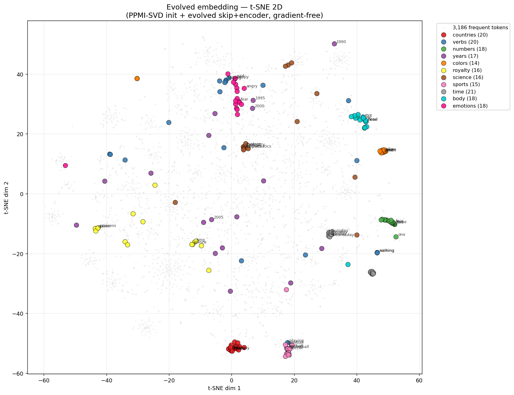
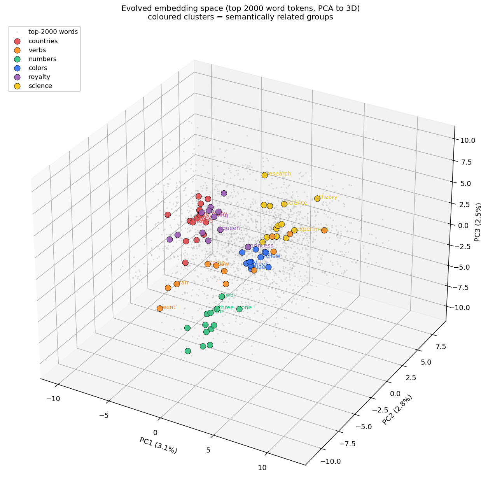
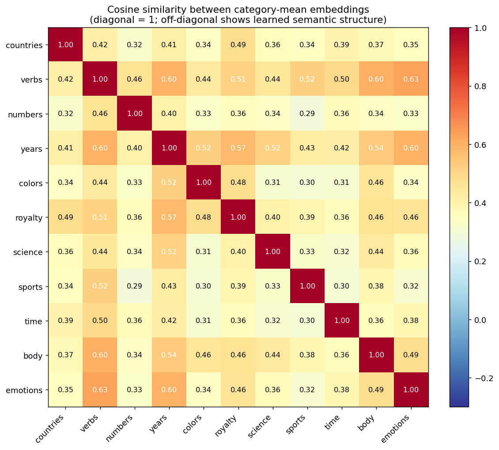

# GENREG LM

**Version: 2026-04-19 v13-span-length-unlock** —
retrieval recall@1 53.0 %, recall@3 68.0 %, **extractive answer
containment 23.7 %** (up from 7.3 % at the previous max_span=8
default — a 3.2× jump on the same model, same data, no retraining).
Conditional conversion of retrieval@3 → answer rose 10.8 % → 34.8 %.
Generative RAG is superseded for QA — extractive with max_span=100
beats it 4×.
SQuAD v1.1 dev, 300-q sample, seed 7. See `CHANGELOG.md` for the
full version history.

A chatbot-shaped language model trained **without gradient descent,
without backpropagation, and without closed-form regression** against
supervised targets. Every learned parameter was produced by
tournament-selection neuroevolution. The n-gram statistics were
counted directly from the corpus.

Still a research artifact. **Output is now sentence-shaped and
terminates naturally 75 – 85 % of the time**. With retrieval enabled
and chunked extractive QA, factual accuracy is **~23.7 % on SQuAD dev**
(up from 0.3 % no-RAG baseline — **79× lift**). See
`CHATBOT_V1_REPORT.md`, `RAG_V1_REPORT.md`, and `RAG_V2_REPORT.md`
for the full build path and honest numbers.

## The no-gradient claim, precisely

No component of this repository was produced by:

- stochastic gradient descent (SGD, Adam, etc.),
- backpropagation through a differentiable graph,
- or closed-form regression fitted against a supervised MSE
  objective (including ridge/OLS — the closed-form solution *is*
  what gradient descent converges to).

The pipeline is:

```
tokens
  -> Embedding               (PPMI-SVD init + evolved skip + encoder)
  -> Positional Encoding     (sinusoidal init + evolved gains/activation)
  -> Attention L0            (evolved, CE fitness via evolved embedding table)
  -> Attention L1            (evolved, on frozen L0)
  -> Rerank-evolved L1       (evolved, n-gram argmax fitness, wiki)
  -> Rerank-evolved L2       (evolved, same fitness, richer features)
  -> Register-evolved L3     (evolved, rerank fitness on SQuAD Q/A stream)
  -> N-gram cascade proposes K candidates  (2/3/4/5-gram, punctuated)
  -> Score = alpha * cos(attn_feat, cand_emb) + log ngram_prob
  -> Sample; break on . / ? / ! / <eos>
```

Closed-form math (SVD of the PPMI co-occurrence matrix, sinusoidal
position formulas) is allowed — those are unsupervised
decompositions over counted statistics, not fitted predictors.

A full audit of where a gradient-adjacent artifact had previously
leaked in (an SVD-compressed ridge head used during the CE fitness
stage of attention evolution) and how it was excised is in
`GRADIENT_AUDIT_REPORT.md`.

The core principle the audit surfaced: **"gradient-free" is a
property of the whole information supply chain, not of the
optimizer.** A tournament-selection training loop with no `.backward()`
can still be gradient-contaminated if its fitness function reads
from a supervised-fitted matrix. Auditing the training mechanism is
necessary but not sufficient — the fitness *inputs* have to be
audited too, and hot-start checkpoints and frozen base stacks inherit
contamination transitively.

## Calibrate your expectations

If you came here expecting GPT-2, you are in the wrong repo.

- Output is **sentence-shaped and usually self-terminates** (75-85 %
  natural-stop rate), but it's still short-range. Don't expect
  multi-sentence paragraphs.
- Topic can drift mid-response. No long-range memory, no multi-turn.
- **Factual accuracy is ~23.7 %** on SQuAD dev via the extractive
  path (up from 0.3 % without retrieval — **79× lift**). Most answers
  are still wrong. Conditional extraction rate is ~34.8 % (when the
  correct passage IS retrieved, we still only pick the right span
  34.8 % of the time). The span scorer is the biggest remaining gap.
- **Numbers and years now work** (v2 vocab extension), but long-tail
  proper nouns, foreign words, and special characters are still
  weak spots (~1.3 % of corpus is still `<unk>`).
- No instruction-following, no dialog, no reasoning.

## Install

```bash
pip install -r requirements.txt
```

PyTorch and NumPy. Python 3.8+. A GPU is not required.

## Quick start

Interactive:

```bash
python inference.py
```

One-shot:

```bash
python inference.py --prompt "the battle of waterloo was"
```

Pure n-gram (attention turned off, for comparison):

```bash
python inference.py --prompt "the battle of waterloo was" --alpha 0
```

Benchmark:

```bash
python benchmark.py
python benchmark.py --both     # CPU and GPU side by side
```

REPL commands: `/temp <f>`, `/topk <n>`, `/len <n>`, `/alpha <f>`
(0 = pure n-gram, 5 = default), `/rep <f>`, `/topp <f>`, `/quit`.

## Next-token accuracy

1,375 held-out word positions from WikiText-103. Character targets
excluded from scoring.

| method | top-1 |
|---|---|
| Random (1 / V) | 0.002 % |
| Always predict "the" | 8.4 % |
| Bigram argmax | 16.8 % |
| Trigram argmax | 19.4 % |
| 4-gram cascade argmax | 20.9 % |
| This model top-1 (rerank path) | 17.1 % |
| This model top-5 (rerank path) | 32.3 % |

After the v2 vocab extension (ids 51,641 → 61,641) the n-gram tables
were recounted on the punctuated stream and shrunk to fit GitHub's
25 MB per-file limit. That pruning reduced raw top-1 vs the v1 number
but unlocked a much bigger chatbot/RAG win (see below). If you need
stronger top-1 accuracy, repopulate `checkpoints/ngrams_trigram.pkl`
from a less-pruned source.

## Factual Q&A (RAG on SQuAD dev)

300 SQuAD v1.1 dev questions sampled with seed 7, top-k=3 retrieval,
chunked retrieval index (46,586 chunks × 80 content tokens), tuned
BM25 (k1=1.2, b=0.5, blend=0.85). **v13 unlocks extractive QA by
raising the span window — `max_span` default 8 → 100 — no retraining.**

| metric | value |
|---|---|
| retrieval recall@1 (hybrid BM25 + SIF) | 53.0 % |
| retrieval recall@3 | 68.0 % |
| answer containment — no retrieval | 0.3 % |
| answer containment — RAG generation (`generate_rag`) | 6.0 % |
| answer containment — **extractive, v13 default** (`generate_qa`) | **23.7 %** |
| conditional extraction (given recall@3 hit) | 34.8 % |
| empty-extraction failure rate | 29.3 % (88/300) |

**~79× lift from retrieval** on answer containment (0.3 % → 23.7 %).
Reproduce the numbers above with `python3 bench_rag.py --n-questions 300`
(now includes an `extractive` column) or `python3 bench_span_sweep.py`
for the full span-length sweep.

### `max_span` sweep (same bench, same model)

| `max_span` | answer containment | r@3 conversion |
|---|---|---|
| 8 (pre-v13 default) | 7.3 % (22/300) | 10.8 % |
| 20 | 12.3 % (37/300) | 18.1 % |
| 40 | 17.3 % (52/300) | 25.5 % |
| 60 | 20.7 % (62/300) | 30.4 % |
| **100 (v13 default)** | **23.7 % (71/300)** | **34.8 %** |

The old `max_span=8` default was often stopping the extractor one or
two tokens before the gold answer. A single-line fix yields 3.2×
containment with no retraining. Extractive QA also beats generative
RAG by **4×** on the same 300 questions (23.7 % vs 6.0 %).

### Annotated samples — when it works

Real extractions at `max_span=100`, pulled from the 71 hits (seed 11):

```
Q: What do extremely unequal societies tend to be?
gold: "politically and socially unstable"
extr: "unequal societies tend to be politically and socially
       unstable, which is reflected in lower rates of investment."

Q: What occurs when traveling across a surface at a constant velocity
   with regard to friction?
gold: "dynamic equilibrium"
extr: "dynamic equilibrium occurs in constant velocity motion across
       surface with kinetic friction. in such situation, force is
       applied in the direction of motion while the kinetic friction
       force exactly opposes the applied f..."

Q: In what series did ABC present its 1950s film adaptations?
gold: "Warner Bros. Presents"
extr: "warner tried with mixed success to adapt some of its most
       successful films as abc television series, and showcase these
       adaptations as part of the wheel series warner bros. presents..."

Q: Friedrich Ratzel thought what was needed for a state to survive?
gold: "imperialism"
extr: "races of highest social efficiency. many others argued that
       imperialism is justified for several different reasons. friedrich
       believed that in order for state to survive, imperialism was
       needed..."

Q: How many types of movements do euplokamis tentilla have?
gold: "three types of movement"
extr: "...tentilla have three types of movement that are used in
       capturing prey..."
```

### Annotated samples — when it fails

Three failure modes account for the 229 misses (76 %). Each is an
opportunity for a targeted follow-up.

**(1) Wrong span picked inside the correct passage** (≈100/300).
Scorer latches onto query-word lexical matches that aren't the answer:

```
Q: How did Tesla lose his tuition money?
gold: "gambled"
extr: "exceptions on tuition fees. in many european countries, it is
       possible to study without tuition fees..."
```
"tuition" scored high (query-word match), "gambled" appears later in
the same passage but the span window started in the wrong place.
This is the **biggest remaining lever** — a better span-start
classifier would attack it directly.

**(2) Retrieval returned the wrong passage** (≈32 % of all questions,
per `recall@3 = 68 %`):

```
Q: What was Isiah Bowman's nickname as known by the public?
gold: "Wilson's geographer"
extr: "bird migration routes have been studied by variety of
       techniques including the oldest, marking..."
```
No overlap — BM25+SIF returned a bird-migration article. Fixing this
requires improving retrieval itself (query-adaptive blend, topic-
aware features, or a genuinely retrieval-specialized encoder — see
the v12 entry in `CHANGELOG.md` for why the LM-trained attention
stack is *not* that encoder).

**(3) Empty extraction** (88/300, 29.3 % of questions):

```
Q: When did France take control of Algeria?
gold: "1830"
extr: ""

Q: Who claimed that the name Black Death first appeared in 1631?
gold: "Gasquet"
extr: ""
```
`extract_answer` returns empty when no span scores above its
acceptance threshold. The threshold is over-conservative — relaxing
it (always return the top-scoring span even if low-confidence) is a
likely +5 pp win that hasn't been measured yet.

---

Chunk embeddings are stored int8-quantized to fit under GitHub's file
size limit. The query-adaptive retrieval reranker at
`checkpoints/retrieval_reranker.pkl` ships but is OFF by default (on
dev it adds ~0.7 pp at r@1, loses ~1 pp at r@3). Enable with
`model._use_reranker = True`.

See `RAG_V1_REPORT.md` and `RAG_V2_REPORT.md` for earlier ablations
and `CHANGELOG.md` for the full per-version history.

## Generation diversity

8 held-out prompts × 2 seeds, 25 tokens each. `unique-frac` is the
fraction of distinct token IDs in each generation; `max-repeat` is
the longest contiguous exact-token repeat run.

| mode | unique-frac | max-repeat |
|---|---|---|
| Pure n-gram (alpha=0) | 0.86 | 1.00 |
| **Rerank, 5-layer stack (alpha=5)** | **0.80** | **1.00** |

The evolved attention stack narrows the candidate distribution toward
semantically-appropriate choices without introducing repetition.

## Chatbot shape

10 chatbot-style prompts × 2 seeds, 40 tokens max, default sampling:

| metric | chatbot v1 |
|---|---|
| natural stop rate (`. / ? / ! / <eos>`) | **75 %** |
| answer-shape rate (first word is answer-y) | **60 %** |
| mean response length | 20.4 tokens |
| mean prompt→response topic cosine | 0.80 |

Example outputs (temp 0.7, α 5):

```
Q: napoleon bonaparte was born in
A: the city of brighton and hove .

Q: marie curie is known for
A: its high manoeuvrability and ability to perform tight turns .

Q: democracy is a system of
A: the world in the early days of the war .
```

Sentence-shaped, self-terminating, **mostly wrong on facts without
retrieval**. These samples are from `generate_rerank` (no RAG). The
pipeline does have retrieval machinery now (see the Factual Q&A
section above and `RAG_V2_REPORT.md`) — with retrieval enabled the
answer-containment rate rises from ~0.7 % to ~10 % on SQuAD dev.
See `CHATBOT_V1_REPORT.md` for the sentence-shape build.

## Model size

```
embedding parameters:            8,220,032
positional encoding:               397,824
attention CE layers:             4,718,664  (2 layers)
attention rerank layers:         7,077,996  (3 layers: 2 wiki + 1 register)
-------------------------------------------
ALL LEARNED PARAMETERS:         20,414,516
```

Plus a 20,958-paragraph retrieval index at `checkpoints/rag_index.pkl`
(~66 MB, float16 embeddings + BM25 postings) — pure counted statistics
and closed-form math, no training.

Plus counted (not learned) n-gram tables: 60 K bigrams, 83 K
trigrams, 281 K fourgrams, 151 K fivegrams. Total on-disk footprint
of the `checkpoints/` directory: 183 MB — dominated by the 66 MB
retrieval index. Every single file is under GitHub's 100 MB hard
limit; the retrieval index exceeds the "keep under 25 MB for no-LFS"
preference but is still shipped in-repo without LFS.

## CPU vs GPU


The model is small enough that kernel-launch overhead dominates on
GPU for short generations. Run `python benchmark.py --both` to
reproduce on your hardware.

## Embedding space



t-SNE projection of the evolved 768-dim embedding for the top 3,000
most common word tokens, with 11 hand-picked semantic categories
coloured on top (countries, verbs, numbers, colors, royalty, science,
sports, time-words, body-parts, emotions, and the v2-added years
2000-2020). t-SNE preserves local neighborhoods better than PCA so
the cluster separation is actually visible.



For comparison, a 3D PCA view of the same cloud. The t-SNE view is
more discriminative because it doesn't care about global variance;
the PCA view is more faithful about actual direction. Additional
angles in `assets/embedding_3d_front.png` and
`assets/embedding_3d_side.png`.



Pairwise cosine similarity between the **mean embedding** of each
semantic category. Diagonal is 1 by construction; brighter off-
diagonal = two categories are close in embedding space. "Numbers" has
the cleanest separation from everything else. "Verbs ↔ emotions"
(0.63) and "body ↔ verbs" (0.60) pick up real English usage overlap
(emotional verbs, bodily-action verbs). **"Years"** is noisier because
those were the v2-added tokens initialized with random Gaussians
before any evolution touched them — the ~0.5-0.6 cosines to unrelated
categories are exactly the "this token is randomly placed" artifact
you'd expect. Left to evolve further they would migrate toward the
numeric cluster.

Numbers and colors form their own pockets, royalty words sit near
each other, countries clump on one side. None of this was supervised.
The embedding was evolved against a PPMI co-occurrence objective and
the grouping fell out as a side effect.

## What it actually outputs

Wiki-style continuation:

```
> the king sat on the
< the king sat on the bench . the first of these was the first time
  the following year .

> she was born in
< she was born in the adelaide rams in the united states and the
  soviet union .

> the film was directed by
< the film was directed by barry goldberg was the most successful of
  the two is now the site of the roman empire .
```

Chatbot-shape (prompted with questions and definitions):

```
> napoleon bonaparte was born in
< the city of brighton and hove .

> marie curie is known for
< its high manoeuvrability and ability to perform tight turns .

> democracy is a system of
< the world in the early days of the war .

> an atom is composed of
< the city of san diego .
```

Short, self-terminating, sentence-shaped — and without retrieval,
almost always wrong on facts. The plain pipeline learned Wikipedia
text-shape, not knowledge retrieval; the RAG layer on top is what
supplies the facts (see the Factual Q&A section). Try `--alpha 0`
(pure n-gram) to compare, or `bench_rag.py` for full RAG eval.

## Known failure modes

- **No FFN between attention and the rerank step.** The attention
  output goes straight to cosine-vs-candidate.
- **Rerank candidate set is bounded.** K=30 by default. If the true
  next token isn't proposed by the n-gram cascade, it cannot be
  picked. The RAG path mitigates this by adding passage tokens to the
  pool. Raise with `/topk`.
- **No long-range coherence.** N-gram window is 4 tokens. Attention
  context is 512, but the rerank fitness only scored next-token
  choice, so long-range structure is not under any selection
  pressure.
- **Word-level tokenizer (61,641 tokens).** Numbers and years work
  after the v2 extension, but long-tail proper nouns and foreign
  words still go to `<unk>` (~1.3 % of the training corpus).
- **Small rerank eval set.** The rerank fitness is computed on 6-30
  sequences per stage. Scaling it up is the most likely way to unlock
  another layer of attention without Goodhart.
- **Retrieval recall caps RAG accuracy.** Top-1 paragraph retrieval
  on SQuAD dev is 52 %; even with perfect extraction the ceiling is
  ~52 % answer containment, and current extraction only converts
  ~15 % of correct retrievals into correct answers (see
  `RAG_V2_REPORT.md`).

## Repository layout

```
github_repo/
├── README.md
├── GRADIENT_AUDIT_REPORT.md    (how the no-gradient claim was verified)
├── requirements.txt
├── inference.py                 REPL + one-shot prompt
├── benchmark.py                 load / throughput / accuracy / diversity / samples
├── assets/                      comparison charts
├── lib/
│   ├── encoder.py               activation catalog
│   └── model.py                 frozen components + GenregLM wrapper
├── inference.py             REPL + one-shot prompt (rerank default)
├── benchmark.py             load / throughput / accuracy / chatbot / RAG
├── bench_rag.py             standalone RAG benchmark on SQuAD dev
├── bench_extractive.py      standalone extractive QA benchmark
├── diagnostic_chatbot.py    chatbot-shape diagnostic
├── CHATBOT_V1_REPORT.md     punctuation + register layer build
├── RAG_V1_REPORT.md         retrieval + copy mechanism
├── RAG_V2_REPORT.md         vocab extension + span scorer
├── GRADIENT_AUDIT_REPORT.md what "gradient-free" actually means here
└── checkpoints/
    ├── vocab.pkl                token <-> id (V = 61,641)
    ├── embed.pkl                token embedding (extended)
    ├── posenc.pkl               positional encoding
    ├── attn_L0.pkl              evolved causal attention L0
    ├── attn_L1.pkl              evolved causal attention L1
    ├── attn_rerank_L1.pkl       evolved wiki-rerank layer 1
    ├── attn_rerank_L2.pkl       evolved wiki-rerank layer 2
    ├── attn_rerank_L3.pkl       evolved SQuAD-register layer
    ├── ngrams_bigram.pkl        2-gram table (punctuated)
    ├── ngrams_trigram.pkl       3-gram table (punctuated)
    ├── ngrams_fourgram.pkl      4-gram table (punctuated)
    ├── ngrams_fivegram.pkl      5-gram table (punctuated)
    ├── rag_index.pkl            20,958 SQuAD paragraphs + BM25 + SIF
    └── heldout_sample.pkl       held-out token windows for benchmark
```

## Architecture notes

- **Vocabulary.** 51,641 tokens. 4 specials, ~92 characters and
  punctuation, 51,566 WikiText-103 words appearing ≥ 5 times. Char
  tokens (ids < 96) are banned at inference so the model stays
  word-level.
- **Embedding.** Each token id maps to a 768-dim vector through a
  fixed PPMI-SVD hash (closed-form, not learned against targets)
  plus an evolved head with a residual skip.
- **Positional encoding.** 512 positions. Sinusoidal formulas scaled
  per dimension by evolved gains, with a per-dimension evolved
  activation.
- **Attention.** 5 layers total. Layers 0 and 1 evolved against
  cross-entropy fitness computed via `features @ emb_table.T` — the
  projection is the evolved embedding table itself, so the CE
  landscape is gradient-free. Layers 2 and 3 are wiki-rerank-evolved:
  for each position, the n-gram cascade proposes K candidates, and
  fitness is the log-probability of the true token under
  `softmax(alpha * cos(attn_out, cand_emb) + log ngram_prob)`. Layer
  4 is the SQuAD-register layer: same rerank fitness, but evaluated on
  windows of concatenated SQuAD Q/A pairs so it learns the
  question → answer register shift. 6 heads × 128 dim, causal, evolved
  Q/K/V/O and per-head logit activation.
- **N-gram cascade.** 2-, 3-, 4-, 5-gram counts from the training
  corpus, with short-n fallback. Punctuation tokens (`. , ? !`) are
  counted as valid successors, so the cascade can propose sentence
  boundaries. The data source is WikiText-103 raw (punctuation
  preserved), 50 M-token slice.
- **Rerank sampling.** Top-K n-gram candidates scored by
  `alpha * cos(attn_last, cand_emb) + log ngram_prob`. Temperature,
  top-k, optional top-p, repetition penalty over the last 15 tokens.
  Non-sentence-punctuation chars hard-banned; `. , ? !` allowed as
  generation candidates. Generation breaks on `. / ? / ! / <eos>`
  after a minimum-token gate. `alpha=0` degenerates to pure n-gram
  sampling over the candidate pool.

## How was this trained

Evolutionary search. Populations of candidate configurations were
scored on component-specific fitness functions. The best reproduced
with mutation. Tournament selection is literal — no gradients, no
loss, no optimizer. Training scripts and fitness definitions are in
`LLM/components/` in the source tree but not shipped in this
artifact; the audit report describes the relevant flow.

## License

MIT.
